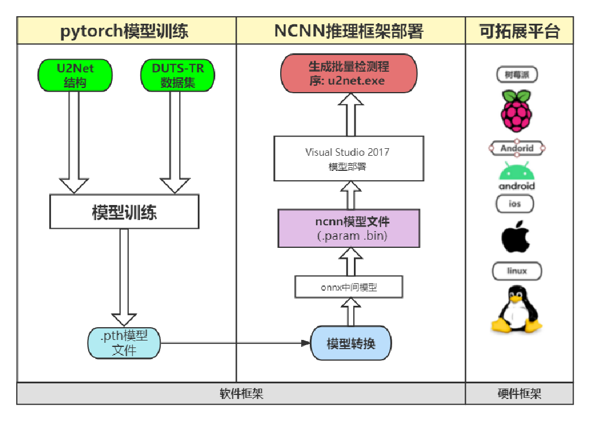

（林老师软工结伴作业 队伍名称：柯老板手下）
# 基于U2Net的前景分割应用

## 1.项目思路概要

 问题分析：需求是将视频图像中的人像与背景分割开，追求主体边缘清晰性和精准性
 目标：构建一款快速、高精度且易于移植到移动端的SOD项目
 解决思路： 通过pytorch训练U2Net模型，再通过NCNN推理框架下进行部署
 项目优化：采用Rescale、RGB2BGR、双线性插值等优化方法
 
 解决方案：
 ①使用U2Net结构和DUTS-TR数据集进行模型训练得到对应的.pth模型文件(开源代码，非原创)
 ②然后在NCNN推理框架下进行部署，先将.pth文件转化为onnx中间模型，再转化为nccn模型文件（.param和.bin文件）
 ③在Visual Studio2017上进行模型的部署，最后生成批量检测
 ④最后使用QT简单的UI界面 展示功能

## 2.算法模型介绍

​	采用一个非常简单的架构U2Net可以很好的解决上边的问题，U2Net是一个两级的嵌入U型网络结构，这是一种新型的网络结构不需要进行预训练，从头训练也可以得到很好的结果。而且，这种网络结构实现了在网络层数加深的同时能够保持较高的分辨率。

### 主要优点

​	第一，该网络是一个两层嵌套的U型结构，没有使用图像分类的预训练主干模型，可以从头训练，因此是灵活的，可适应不同的工作环境，性能损失很小

​	第二，新的体系结构允许网络更深入、获得高分辨率，而不会显著增加内存和计算成本。在底层，设计了一个新的RSU,能够在不降低特征映射分辨率的情况下提取级内多尺度特征。

## 3.优化方案及部署

### 项目工程化

#### 模型前向推理加速—— ncnn

 ncnn是一个为移动端极致优化的高性能神经网络前向计算框架。ncnn 从设计之初深刻考虑手机端的部署和使用。

​	无第三方依赖，跨平台，手机端 cpu 的速度快于目前所有已知的开源框架。

## 4.项目结果展示及说明

使用qt制作简单的UI界面

##### 初始界面如下：

##### 随机选取图片进行优化

可以看到，虽然背景有各种干扰，但效果仍然很好。
